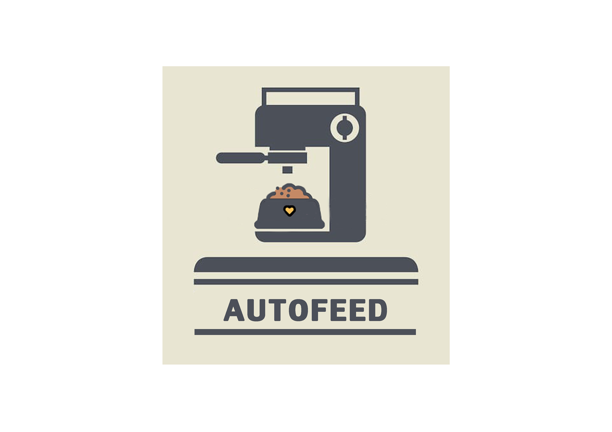

# Autofeed Controller

## Computer Programming Project - Autofeed Controller - Automatic Food Feeding Machine

## Introduction
Autofeed Controller คือโปรเจคในวิชา Computer Programming โดยโปรเจคนี้เป็นการนำภาษา C มาเขียน
เพื่อทำงานในระบบ Arduino บนบอร์ด NodeMCU - ESP8266

## How to
วิธีการใช้งานนะครับเราสามารถสั่งให้ฝาที่ปิดอาหารเปิดเพื่อให้อาหารหล่นมาที่ช่องด้านล่างเพื่อให้สัตว์เลี้ยงเข้ามาทานอาหารได้
ผ่านระบบ Firebase Realtime Database นะครับซึ่งระบบนี้สามารถควบคุมได้ทั้งเว็บไซต์ และบน Smart Device ต่างๆนะครับ

อีกทั้งเราสามารถตั้งเวลาให้เครื่องเปิดฝาให้อาหารอัติโนมัติตามที่เราตั้งไว้ได้ผ่านตัว RTC ที่เราได้ใช้ในการเก็บค่าเวลาครับ
** แต่ใน code ที่ upload นี้ได้ตั้งให้เป็นทุกๆ 30 วินาทีเพื่อเป็นการเช็คระบบครับ

## Install
การติดตั้งสำหรับการทำงานของเครื่องนี้นะครับมีเพียง 2 อย่างง่ายๆคือ
1. พาวเวอร์แบงค์สำหรับเป็นแหล่งพลังงานให้ NodeMCU ทั้ง 2 ตัว
2. WiFi เพื่อใช้งานระบบสั่งการระยะไกลได้

## Members
- 61070032 นาย ชนกันต์ สุดตาธรรม [Chanakan32](https://github.com/Chanakan32)
- 61070223 นาย สรวิศ ผาวิรัตน์ [Soravit8] (https://github.com/Siravit8)
- 61070198 นาย วรพัฒน์ ปักกาเวสา [Borrabeer](https://github.com/borrabeer)
- 61070226 นาย ศุภพัฒน์ ภูริวิทย์วัฒนา [Supapatfirst](https://github.com/Supapatfirst)
